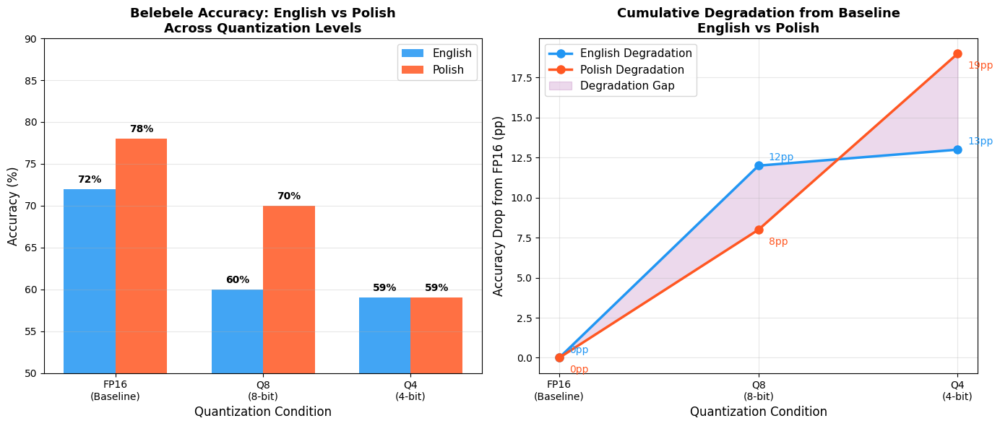

# The Disproportionate Impact of PTQ on Multilingual Reasoning: English vs. Polish Degradation in Llama-3

> Master's Thesis Research | Vistula University, Warsaw | 2026  
> Author: Muhammed Fariz Palli Valappil  
> Supervisor: dr hab. Paweł Gburzyński

## The Research Question

When you compress a Large Language Model to run on consumer hardware, whose languages bear the cost?

This study investigates whether Post-Training Quantization (PTQ)
degrades Polish reasoning disproportionately compared to English
in Meta-Llama-3-8B-Instruct — and whether a "Quality Gap" 
emerges for non-English European users of compressed models.

---

## Key Finding — The Convergence Effect



| Condition | English | Polish | Gap |
|-----------|---------|--------|-----|
| FP16 (Baseline) | 72% | 78% | PL +6pp |
| Q8 (8-bit) | 60% | 70% | PL +10pp |
| Q4 (4-bit) | 59% | 59% | 0pp |

**Polish degraded 46% more severely than English under 4-bit NF4 quantization** (19pp vs 13pp drop from baseline),
completely erasing its 6-point full-precision advantage.

This phenomenon is termed the **Convergence Effect**: the complete erasure of a secondary language's performance advantage through aggressive model compression.

---

## What is the Convergence Effect?

At full precision (FP16), Polish *outperforms* English by 6 percentage points on Belebele reading comprehension.
At Q8, Polish remains more resilient. 
But at Q4, Polish collapses — dropping 19pp to converge exactly with English at 59%.

Three mechanisms drive this:
1. **Weight Sparsity** — Polish representations are less densely reinforced in the training data, making them more sensitive to 4-bit approximation errors
2. **Tokenization Penalty** — Polish requires ~45% more tokens than English for equivalent content (O(n²) attention cost compounds quantization error)
3. **Calibration Mismatch** — NF4 quantization grid is implicitly optimized for English weight distributions (Chimoto et al., 2026)

---

## Secondary Finding — Benchmark Infrastructure Gap

During benchmark selection, Polish was found to be entirely absent from three major multilingual evaluation datasets:

| Benchmark | Task | Polish? |
|-----------|------|---------|
| mGSM | Math Reasoning | ❌ |
| XCOPA | Causal Commonsense | ❌ |
| XNLI | Natural Language Inference | ❌ |
| **Belebele** | Reading Comprehension | ✅ |

A language spoken by 45 million people and holding official EU status is excluded from the standard multilingual evaluation toolkit. This gap is itself contribution of this research.

---

## Methodology

- **Model:** Meta-Llama-3-8B-Instruct
- **Quantization:** FP16 / Q8 (LLM.int8()) / Q4 (NF4)via bitsandbytes + HuggingFace Transformers
- **Benchmark:** Belebele (Meta, 2023) — eng_Latn vs pol_Latn
- **Evaluation:** 100 questions per condition, deterministic decoding (do_sample=False)
- **Platform:** Google Colab, Tesla T4 (15GB VRAM)

---

## Reproducing the Results

All code is in `evaluation_pipeline.ipynb`.

Requirements:
- Google Colab (free tier, T4 GPU)
- HuggingFace account with Llama-3 access approved
- bitsandbytes, transformers, accelerate

```bash
pip install transformers accelerate bitsandbytes datasets
```

Then run the notebook cells in order. Full instructions inside the notebook.

---

## Repository Structure
├── LLM_quantization_research.ipynb  # Full experiment code

├── results/

│   └── quantization_results.png  # Key findings chart

├── data/

│   └── results_summary.csv    # Raw accuracy numbers

└── thesis/

|  └── thesis_abstract.md     # Abstract and summary

|  └── thesis_document.pdf    # Original research document

---

## References

- Bandarkar et al. (2023). The Belebele Benchmark. 
  arXiv:2308.16884
- Chimoto et al. (2026). Calibrating Beyond English. 
  arXiv:2601.18306
- Dettmers et al. (2022). LLM.int8().
- NeurIPS 2022
- Dettmers et al. (2023). QLoRA.
- NeurIPS 2023
- Marchisio et al. (2024). How Does Quantization Affect Multilingual LLMs?
- EMNLP 2024
- Meta AI (2024). Llama-3-8B-Instruct Model Card

---

*Full thesis available on request.*
